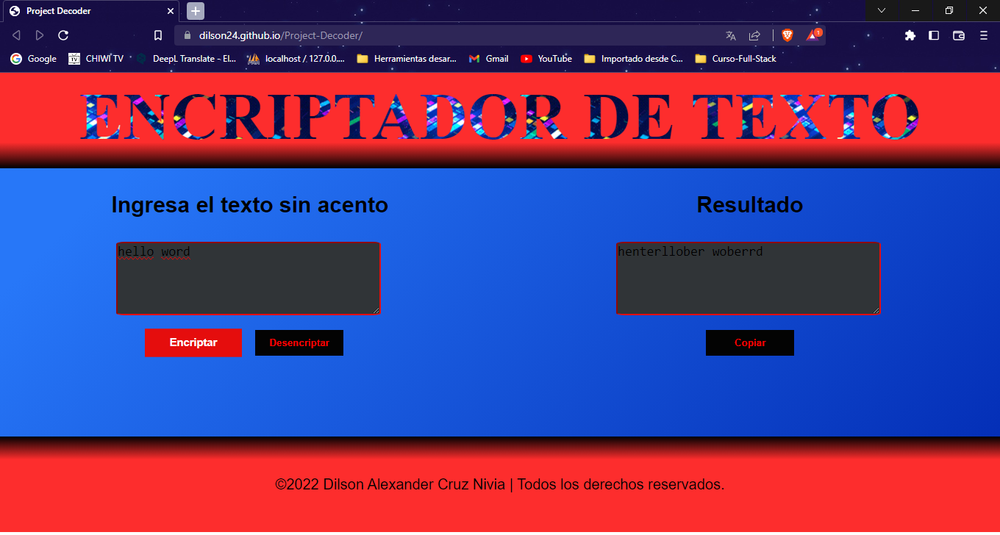
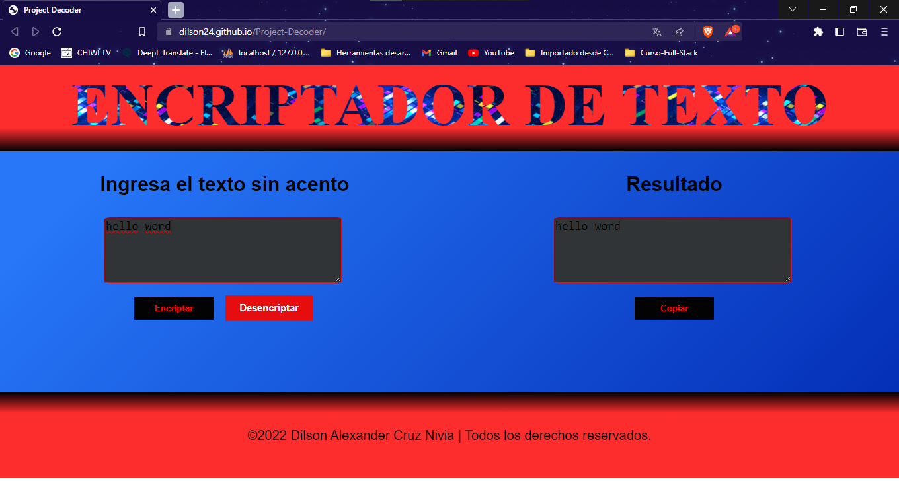
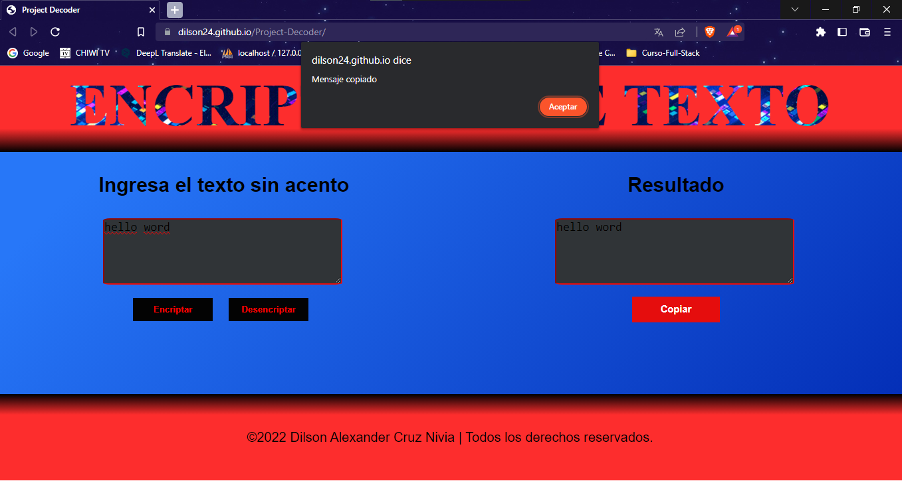

## Project-Decoder
Este proyecto consta de un sencillo decodificador de texto el cual reemplaza las vocales por letras y su vez vuelve al estado original del texto, también posee la función de copiar el texto decodificado.

## Project-Decoder
This project consists of a simple text decoder which replaces vowels with letters and returns to the original state of the text, it also has the function of copying the decoded text.

## Caracteristicas

- Botón *Encriptar*.
- Botón *Desencriptar*.
- Botón *Copiar*.
- Título con efecto GIF.
- El texto ingresado por usuario es automáticamente convertido a minúscula.

## Features
- *Encrypt* button.
- *Decrypt* button.
- *Copy* button.
- Title with GIF effect.
- Text entered by user is automatically converted to lowercase.

## Authors
- [@Dilson24](https://www.github.com/Dilson24) - Codificación y documentación.

## Screenshots
### Home

## Tech
- [JavaScript] -  Interpreted programming language.
- [HTML5] - HyperText Markup Language, versión 5.
- [CSS] - Cascading Style Sheets.

## License
**Free Software, Hell Yeah!**
[MIT](https://choosealicense.com/licenses/mit/) © 2022 - Dilson Alexander Cruz Nivia

 [JavaScript]: <https://lenguajejs.com/>
 [HTML5]: <https://lenguajehtml.com/html/>
 [CSS]: <https://lenguajecss.com/css/>